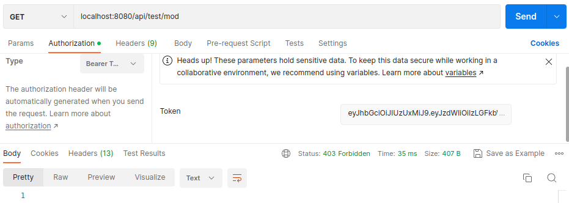

# Ejemplo de autenticación y autorización con Spring-Boot y JWT

## Introducción

Ejemplo para trabajar autenticación y autorización con Spring Security utilizando token con JWT.

>Este tutorial está basado en el [tutorial de bezcoder.com](https://www.bezkoder.com/spring-boot-security-jwt/). Se le hicieron cambios para que el token sea devuelto en el login de usuario y luego enviar dicho token en cada solicitud a las APIs. Además, tiene otras mejoras.

Este  ejemplo muestra una aplicación REST con Spring Boot que maneja la autenticación y autorización mediante JWT (Json Web Token). La aplicación utiliza una base de datos H2 para almacenar datos de los usuarios, sus roles y artículos. La interacción principal de la aplicación se muestra en la siguiente Figura.


## Creación del proyecto java con Spring Boot

Para inicializar el proyecto se puede utilizar la herramienta [initializer de Spring Boot](https://start.spring.io/). En esta pagina llenar los campos del inicializador según la siguiente imagen.

. 

El tipo de proyecto se puede usar Maven o Gradle. Recomendamos usar Gradle porque es más legible leer las dependecias, en lugar de Maven que usr un formato en XML. Si usa Gradle asi quedaría el archivo build.gradle:
```
plugins {
	id 'java'
	id 'org.springframework.boot' version '2.7.11'
	id 'io.spring.dependency-management' version '1.0.15.RELEASE'
}

group = 'com.company.demo'
version = '0.0.1-SNAPSHOT'
sourceCompatibility = '11'

repositories {
	mavenCentral()
}

dependencies {
	implementation 'org.springframework.boot:spring-boot-starter-data-jpa'
	implementation 'org.springframework.boot:spring-boot-starter-security'
	implementation 'org.springframework.boot:spring-boot-starter-web'
	developmentOnly 'org.springframework.boot:spring-boot-devtools'
	runtimeOnly 'com.h2database:h2'
	testImplementation 'org.springframework.boot:spring-boot-starter-test'
	testImplementation 'org.springframework.security:spring-security-test'
	implementation 'org.springframework.boot:spring-boot-starter-validation'
	implementation group: 'io.jsonwebtoken', name: 'jjwt', version: '0.9.1'

}

tasks.named('test') {
	useJUnitPlatform()
}


```

La tecnología usada como se aprecia en la Figura anterior es:
* Spring Boot 2.7.11
* Java 11
* H2 (Base de datos embebida)
* jjwt 0.9.1

## Propiedades de la aplicación

En la carpeta src/main/resources, está el archivo **application.properties** que tiene las siguientes lineas de configuración para la base de datos h2 y la generación de tokens:

```
spring.h2.console.enabled=true
spring.h2.console.path=/h2-ui
spring.datasource.url=jdbc:h2:file:./testdb
#spring.datasource.url: jdbc:h2:mem:testdb
spring.datasource.driverClassName=org.h2.Driver
spring.datasource.username=sa
spring.datasource.password=
spring.jpa.show-sql=true
spring.jpa.properties.hibernate.dialect=org.hibernate.dialect.H2Dialect
spring.jpa.hibernate.ddl-auto= update
# 24 horas * 60 minutos  * 60 segundo * 1000 = 86400000 = 24 hours
app.jwtExpiration= 86400000
app.jwt.secret=abcdefghijklmnOPQRSTUVWXYZ
```
* *spring.datasource.url* configura el nombre de la base de datos. Si se quiere que la base de datos esté en memoria en lugar de disco se usa jdbc:h2:mem:[nombre de la base de datos].
* *spring.datasource.username* y *spring.datasource.password* son las credenciales de la base de datos h2.
Spring Boot utiliza Hibernate como implementación de JPA. Hemos utiliado la configuración H2Dialect para la base de datos H2.
* *spring.jpa.hibernate.ddl-auto* se utiliza para la inicialización de la base de datos. Establecemos el valor para actualizar el valor para que se cree una tabla en la base de datos automáticamente correspondiente al modelo de datos definido. Cualquier cambio en el modelo también activará una actualización de la tabla. Para la producción, esta propiedad debe validarse.
* *spring.h2.console.enabled=true* le dice a Spring que inicie la herramienta de administración de la base de datos H2 y puede acceder a esta herramienta en el navegador: http://localhost:8080/h2-console.
* *spring.h2.console.path=/h2-ui* es para la URL de la consola H2, por lo que la URL predeterminada es http://localhost:8080/h2-console y la hemos cambiado a http://localhost:8080/h2-ui.

## Estructura del Proyecto

Este es la estructura de carpetas y archivos para este ejemplo de Spring Boot Security JWT.


> Para no hacer este tutorial tan largo no mostramos el código fuente de las clases porque se pueden ver en el proyecto Github.

**auth**: Este paquete contiene la implementación y configuración de Spring Boot Security para hacer auteticación y autorización mediante JWT.

* *ApplicationSecurity*.  Esta clase configura la seguridad global de la aplicación. El método configure() hace varias cosas importantes: le dice a Spring Security cómo configurar el CORS y CSRF; qué rutas necesitarán autenticación y cuáles no; qué filtro (JwtTokenFilter) y cuándo queremos que funcione; cargará los detalles del usuario para realizar la autenticación y autorización; finalmente, el método passwordEncoder() permite cifrar las contraseñas de los usuarios.
* *JwtTokenFilter*. Esta clase define un filtro que se ejecuta cada vez que se hace una solicitu a las APIs. JwtTokenFilter extiende OncePerRequestFilter y sobreescribe el método doFilterInternal(). Este método doFilternInternal() obtiene el JWT de la cabecera HTTP,
si la solicitud tiene JWT, lo valida, analizar el usuario y establecer los detalles de usuario actual en SecurityContext utilizando el método setAuthenticationContext().
* *JwtTokenUtil*. Esta clase genera un nuevo token a partir de un usuario mediante el método generateAccessToken(User). Tambien valida si un token es válido mediante el método validateAccessToken(token).
* Se utilizan varios POJOs que están en *payload* para manejar las solicitudes y las respuestas de las APIs. Las más importantes las resumimos así:
    * LoginRequest: { email, password }
    * RegisterRequest: { email, password, roles }
    * LoginResponse: { email, roles, token }
    * MessageResponse: { message }

**controller**: Este paquete contiene todas las APIs de la aplicación:

* *AuthApi*. Manejas las solicitudes para autenticar un usuario (/login) y registrar un usuario (/register).
* *ProductApi*. Es una API para crear y consultar productos de una tienda (/products).
* *TestApi*. Es una API Rest para testear los roles de los usuarios. No interactua con una base de datos, simplemente si devuelve un String si el usuario tiene el rol adecuado para invocar el servicio. Se manejarn tres roles: user, admin y mod (moderador).

**domain.entities** son los modelos de la aplicación:
* *User*. Representa un usuario de la aplicación con email, password y roles. Cada usuario puede tener uno o varios roles. Un rol puede tener asociados a varios usuario (muchos a muchos). Mediante anotaciones JPA se hace la configuración respectiva de User y Rol.  
* *Rol*. Representa un rol de un usuario.
* *Product*. Representa un producto de una tienda con id, nombre y precio.
* *ERole*. Es una enumeración con tres datos: ROLE_USER,
    ROLE_MODERATOR y ROLE_ADMIN.


**Repository*. Ahora, cada modelo anterior necesita un repositorio para persistir y acceder a los datos. En el paquete del repository, hay 3 repositorios:

* *ProductRepository*. Repositorio de productos.
* *RoleRepository*. Repositoro de roles.
* *UserRepository*. Repositorio de usuarios.

## Compilar y ejecutar de la aplicación

Para compilar la aplicación por consola: 


Con gradle:
```
./gradlew clean build
```
Con maven:
```
./mvnw clean install
```
Para ejecutar proyecto:

Con gradle:
```
./gradlew bootRun
```
Con maven
```
./mvnw spring-boot:run
```
Por defecto, corre en el puerto 8080.

Una vez ejecutada, podemos verificar la conexión de la base de datos H2 con url: [http://localhost:8080/h2-ui](http://localhost:8080/h2-ui):

Haga clic en el botón Conectar, las tablas que definimos en el paquete de modelos se generarán automáticamente en la base de datos. La siguiente gráfica muestra cómo se ve la base de datos:


También necesitamos agregar algunas filas en la tabla de roles antes de asignar cualquier rol al Usuario.
Ejecute las siguientes declaraciones de inserción de SQL:

```
INSERT INTO roles (nombre) VALUES ('ROLE_USER');
INSERT INTO roles (nombre) VALUES ('ROL_MODERATOR');
INSERT INTO roles (nombre) VALUES ('ROLE_ADMIN');
```


Puede verificar que los roles se hayan grabado:


Registre algunos usuarios con /api/register API, por ejemplo:

* admin@gmail.com con el rol ROLE_ADMIN
* mod@gmail.com con el rol ROLE_MOD Y ROLE_USER
* user@gmail.com con el rol ROLE_USER

Para crear los usuarios lo puede hacer desde la herramienta postman, por ejemplo, para crear el usuario mod@gmail.com (asegúrese de seleccionar el método POST, en Body elegir raw y JSON):


Verifique los usuarios registrados en la base de datos:


Además, necesitamos agregar algunos productos en la tabla products:
```
INSERT INTO products (id, name, price) VALUES (1,'televisor', 334);
INSERT INTO products (id, name, price) VALUES (2,'nevera', 1200);

```

### Probando las APIs
Primero debe iniciar sesión con el usuario admin@gmail.com y solicitar un token: GET /auth/login


Copie el token generado y verifiquelo en la página [jwt.io](https://jwt.io/). Se puede apreciar en la Figura que en el payload del token aparece el sub: admin@gmail.com y en el campo authorities está en vector de roles, en este caso el ROL_ADMIN. 


A partir de este token se puede consultar los demás recursos de las APIs. Para acceder al recurso público:  GET /api/test/all


Asegúrse que en postman, en *Authorization*, en *Type* elegir *Bearer Token* y en *token* pegar el token.

Para acceder al recurso admin: GET /api/test/admin


Para acceder al recurso productos: GET /products


Para acceder al recurso mod: GET /api/test/mod



Como este recurso sólo está permitido para usuarios con rol ROLE_MOD, se obtiene un error con código 403 Forbidden.

Finalmente, le queda probar los recursos de las APIs con todos los demás usuarios.

Espero que este tutorial haya sido de su agrado!!